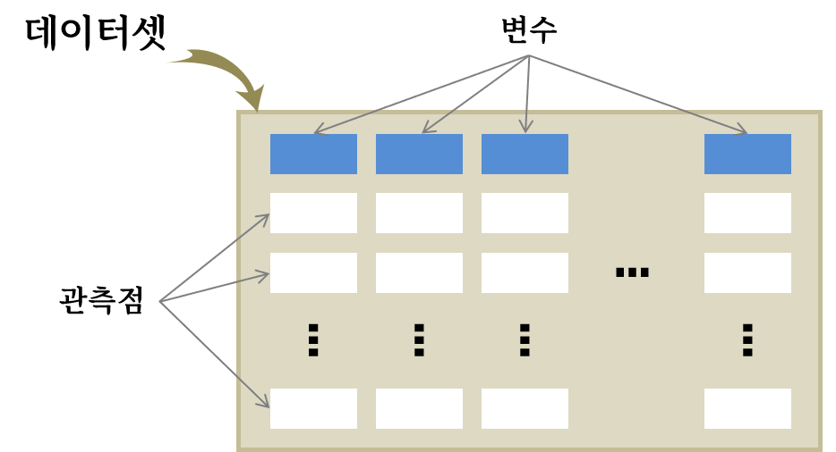

# 데이터 {#about-data}


## 변수와 관측점  {#about-tidydata}

{width=100%}

## 변수 {#about-variables}

```{r breakdown-variables}
library(tidyverse)
library(DiagrammeR)

DiagrammeR::mermaid(diagram = "
                    graph TD
                        A[변수] --> B[수치형]
                        A[변수] --> C[범주형]
                        B --> D[연속형]
                        B --> E[이산형]
                        C --> F[명목형]
                        C --> G[순서형]
                    ")

```


## 변수간 관계 {#about-relation}


## 데이터 수집 원칙 {#data-collection}
 

1. 특정 사례 일반화 오류
1. 모집단과 표본
1. 실험과 관측연구


## 관측연구와 표본 {#data-samples}


```{r sampling, eval = TRUE, echo = FALSE}
library(openintro)
library(extrafont)
loadfonts(device="win") 

set.seed(52)

plot(c(0, 2),
     c(0, 1.1),
     type = 'n',
     axes = FALSE, yaxt="n", xlab="", ylab="")
temp <- seq(0, 2 * pi, 2 * pi / 100)
x <- 0.5 + 0.5 * cos(temp)
y <- 0.5 + 0.5 * sin(temp)
lines(x, y)

s <- matrix(runif(700), ncol = 2)
S <- matrix(NA, 350, 2)
j <- 0
for (i in 1:nrow(s)) {
  if(sum((s[i, ] - 0.5)^2) < 0.23){
    j <- j + 1
    S[j, ] <- s[i, ]
  }
}
points(S, col = COL[1, 3], pch = 20)
text(0.5, 1, '모집단(유권자)', pos = 3, family="MaruBuri", cex = 1.5)


set.seed(50)
N <- sample(j, 25)
lines((x - 0.5) / 2 + 1.5, (y - 0.5) / 2 +  0.5, pch = 20)

SS <- (S[N, ] - 0.5) / 2 + 0.5
these <- c(2, 5, 11, 10, 12)
points(SS[these, 1] + 1,
       SS[these, 2],
       col = COL[4, 2],
       pch = 20,
       cex = 1.5)
text(1.5, 0.75, '표본(여론조사)', pos = 3, family="MaruBuri", cex = 1.2)

for (i in these) {
  arrows(S[N[i], 1], S[N[i], 2],
         SS[i, 1] + 1 - 0.03, SS[i, 2],
         length = 0.08, col = COL[5], lwd = 1.5)
}

```


```{r sampling-stratified, eval = TRUE, echo = FALSE}

plot(c(0, 2),
     c(0, 1.1),
     type = 'n',
     axes = FALSE, xlab="", ylab = "")
temp <- seq(0, 2 * pi, 2 * pi / 100)
x <- 0.5 + 0.5 * cos(temp)
y <- 0.5 + 0.5 * sin(temp)
lines(x, y)

s <- matrix(runif(700), ncol = 2)
S <- matrix(NA, 350, 2)
j <- 0
sub <- rep(FALSE, 1000)
for (i in 1:nrow(s)) {
  if(sum((s[i,] - 0.5)^2) < 0.23){
    j <- j+1
    S[j,] <- s[i,]
  }
  if(sum((s[i, ] - c(0.05, 0.18) - 0.5)^2) < 0.07){
    sub[j] <- TRUE
  }
}
points(S, col = COL[1, 4 - 2 * sub], pch = 20)
text(0.5, 1, '모집단 (유권자)', pos = 3, family="MaruBuri", cex = 1.5)
lines((x - 0.5) * 2 * sqrt(0.07) + 0.55,
      (y - 0.5) * 2 * sqrt(0.07) + 0.68)

set.seed(7)
N <- sample((1:j)[sub], 25)
lines((x - 0.5) / 2 + 1.5,
      (y - 0.5) / 2 + 0.5,
      pch = 20)

SS <- (S[N, ] - 0.5) / 2 + 0.5
these <- c(2, 5, 7, 12, 15)
points(SS[these, 1] + 1,
       SS[these, 2],
       col = COL[4, 2],
       pch = 20,
       cex = 1.5)
text(1.5, 0.75, '표본(여론조사)', pos = 3, family="MaruBuri", cex = 1.2)

for (i in these)  {
  arrows(S[N[i], 1], S[N[i], 2],
         SS[i, 1] + 1 - 0.03, SS[i, 2],
         length = 0.08,
         col = COL[5],
         lwd = 1.5)
}
rect(0.143, 0.2, 0.952, 0.301,
     border = "#00000000",
     col = "#FFFFFF88")
rect(0.236, 0.301, 0.858, 0.403,
     border = "#00000000",
     col = "#FFFFFF88")
text(0.55, 0.5 + 0.18 - sqrt(0.07),
     '경기도 유권자', family="MaruBuri", cex = 1.2, 
     pos = 1)
```


```{r sampling-conept, echo = FALSE}
plot(c(0, 2),
     c(0, 1.1),
     type='n',
     axes=FALSE, xlab="", ylab="")
temp <- seq(0, 2 * pi, 2 * pi / 100)
x <- 0.5 + 0.5 * cos(temp)
y <- 0.5 + 0.5 * sin(temp)
lines(x, y)

s <- matrix(runif(700), ncol = 2)
S <- matrix(NA, 350, 2)
j <- 0
sub <- rep(FALSE, 1000)
for (i in 1:nrow(s)) {
  if (sum((s[i,] - 0.5)^2) < 0.23) {
    j <- j + 1
    S[j, ] <- s[i, ]
  }
  if (sum((s[i, ] - c(-0.15, 0.05) - 0.5)^2) < 0.115) {
    sub[j] <- TRUE
  }
}
points(S, col = COL[1, 4 - 2 * sub], pch = 20)
text(0.5, 1, '조사대상 모집단', pos = 3, family="MaruBuri", cex = 1.5)
lines((x - 0.5) * 2 * sqrt(0.115) + 0.35,
      (y - 0.5) * 2 * sqrt(0.115) + 0.55)

set.seed(7)
N <- sample((1:j)[sub], 25)
lines((x - 0.5) / 2 + 1.5,
      (y - 0.5) / 2 + 0.5,
      pch=20)

SS <- (S[N, ] - 0.5) / 2 + 0.5
these <- c(2, 5, 6, 7, 15)
points(SS[these, 1] + 1,
       SS[these, 2],
       col = COL[4, 2],
       pch = 20,
       cex = 1.5)
text(1.5, 0.75, '표본', pos=3, family="MaruBuri", cex = 1.5)

for(i in these){
	arrows(S[N[i], 1],
	       S[N[i], 2],
	       SS[i, 1] + 1 - 0.03,
	       SS[i, 2],
	       length=0.08,
	       col=COL[5],
	       lwd=1.5)
}
rect(0.145, 0.195, 0.775, 0.11,
     border="#00000000",
     col="#FFFFFF88")
rect(0.31, 0.018, 0.605, 0.11,
     border="#00000000",
     col="#FFFFFF88")
text(0.46, 0.5 + 0.06 - sqrt(0.115),
     '실제 추출되는 표본',
     pos=1, family="MaruBuri", 
     cex=0.8)
```

