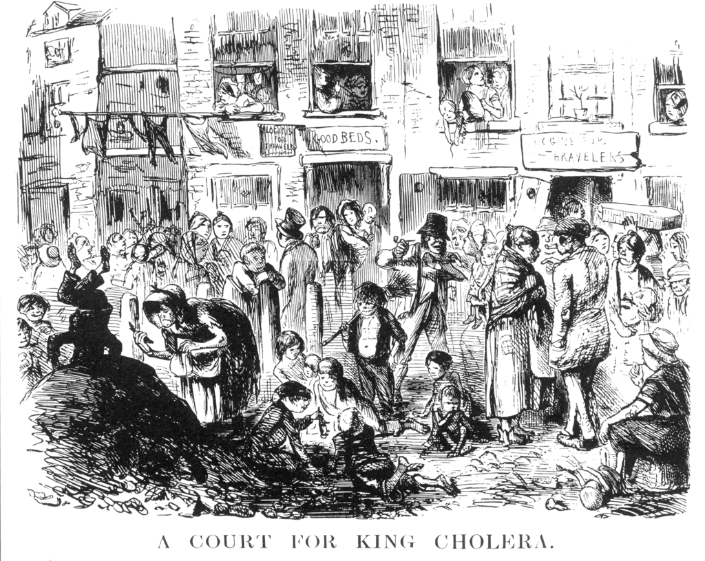
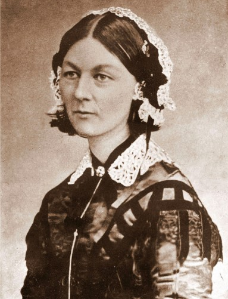

---
output:
  html_document:
    theme:
      version: 4
editor_options: 
  chunk_output_type: console
---


# 사례 [^data-science-case-study] {#case-studies}


```{=html}
<div>
<div class="row p-0 row-cols-1 row-cols-md-2 row-cols-lg-3" style="margin-left: -.2rem; margin-right: -.2rem; margin-top: 1rem; margin-bottom: 1rem; ">
<div class="card bg-transparent m-0 border-0 collapse.show bs4cards-blahblahblah " style="padding: .2rem ; border-width: 0; border-radius: .6rem .6rem .6rem .6rem ;">
<div class="card-body m-0 p-0 col-12" style="visibility: visible; border-style:solid; border-color:inherits; border-width:1px; background-color: inherits;border-radius: .6rem .6rem 0 0 ;">
<div class="row no-gutters h-100 border-0" style="border-radius: .6rem .6rem 0 0 ;">
<div class="col-7 h-100">
<a href="http://aispiration.com/ds-authoring/ds-world-student.html#4">
<h5 class="card-title my-auto px-3 pt-3 pb-1">19세기 코로나</h5>
</a>
<p class="card-text my-auto px-3 pb-3 pt-1">영국 런던에서 19세기 발생한 대규모 전염병</p>
</div>
<div class="col-5" style="border-radius: 0 .6rem 0 0 ;">
<a href="http://aispiration.com/ds-authoring/ds-world-student.html#4" style="color: inherit;">

</a>
</div>
</div>
</div>
<div class="card-footer small text-muted px-3 py-auto" style="border-style:solid; border-color:inherits; border-width:0 1px 1px 1px; border-radius: 0 0 .6rem .6rem ;">2022-06-21</div>
</div>
<div class="card bg-transparent m-0 border-0 collapse.show bs4cards-blahblahblah " style="padding: .2rem ; border-width: 0; border-radius: .6rem .6rem .6rem .6rem ;">
<div class="card-body m-0 p-0 col-12" style="visibility: visible; border-style:solid; border-color:inherits; border-width:1px; background-color: inherits;border-radius: .6rem .6rem 0 0 ;">
<div class="row no-gutters h-100 border-0" style="border-radius: .6rem .6rem 0 0 ;">
<div class="col-7 h-100">
<a href="http://aispiration.com/ds-authoring/ds-world-student.html#5">
<h5 class="card-title my-auto px-3 pt-3 pb-1">손씻기 역사</h5>
</a>
<p class="card-text my-auto px-3 pb-3 pt-1">제멜바이스에 의해 시작된 손씻기</p>
</div>
<div class="col-5" style="border-radius: 0 .6rem 0 0 ;">
<a href="http://aispiration.com/ds-authoring/ds-world-student.html#5" style="color: inherit;">

</a>
</div>
</div>
</div>
<div class="card-footer small text-muted px-3 py-auto" style="border-style:solid; border-color:inherits; border-width:0 1px 1px 1px; border-radius: 0 0 .6rem .6rem ;">2022-06-21</div>
</div>
<div class="card bg-transparent m-0 border-0 collapse.show bs4cards-blahblahblah " style="padding: .2rem ; border-width: 0; border-radius: .6rem .6rem .6rem .6rem ;">
<div class="card-body m-0 p-0 col-12" style="visibility: visible; border-style:solid; border-color:inherits; border-width:1px; background-color: inherits;border-radius: .6rem .6rem 0 0 ;">
<div class="row no-gutters h-100 border-0" style="border-radius: .6rem .6rem 0 0 ;">
<div class="col-7 h-100">
<a href="http://aispiration.com/ds-authoring/ds-world-student.html#6">
<h5 class="card-title my-auto px-3 pt-3 pb-1">나는 정상(?)</h5>
</a>
<p class="card-text my-auto px-3 pb-3 pt-1">육군 신체측정 데이터를 통해본 키의 비밀</p>
</div>
<div class="col-5" style="border-radius: 0 .6rem 0 0 ;">
<a href="http://aispiration.com/ds-authoring/ds-world-student.html#6" style="color: inherit;">

</a>
</div>
</div>
</div>
<div class="card-footer small text-muted px-3 py-auto" style="border-style:solid; border-color:inherits; border-width:0 1px 1px 1px; border-radius: 0 0 .6rem .6rem ;">2022-06-21</div>
</div>
<div class="card bg-transparent m-0 border-0 collapse.show bs4cards-blahblahblah " style="padding: .2rem ; border-width: 0; border-radius: .6rem .6rem .6rem .6rem ;">
<div class="card-body m-0 p-0 col-12" style="visibility: visible; border-style:solid; border-color:inherits; border-width:1px; background-color: inherits;border-radius: .6rem .6rem 0 0 ;">
<div class="row no-gutters h-100 border-0" style="border-radius: .6rem .6rem 0 0 ;">
<div class="col-7 h-100">
<a href="http://aispiration.com/ds-authoring/ds-world-student.html#7">
<h5 class="card-title my-auto px-3 pt-3 pb-1">나폴레옹 러시아 침공</h5>
</a>
<p class="card-text my-auto px-3 pb-3 pt-1">미나르가 제작한 나폴레옹 러시아 침공 시각화</p>
</div>
<div class="col-5" style="border-radius: 0 .6rem 0 0 ;">
<a href="http://aispiration.com/ds-authoring/ds-world-student.html#7" style="color: inherit;">

</a>
</div>
</div>
</div>
<div class="card-footer small text-muted px-3 py-auto" style="border-style:solid; border-color:inherits; border-width:0 1px 1px 1px; border-radius: 0 0 .6rem .6rem ;">2022-06-21</div>
</div>
<div class="card bg-transparent m-0 border-0 collapse.show bs4cards-blahblahblah " style="padding: .2rem ; border-width: 0; border-radius: .6rem .6rem .6rem .6rem ;">
<div class="card-body m-0 p-0 col-12" style="visibility: visible; border-style:solid; border-color:inherits; border-width:1px; background-color: inherits;border-radius: .6rem .6rem 0 0 ;">
<div class="row no-gutters h-100 border-0" style="border-radius: .6rem .6rem 0 0 ;">
<div class="col-7 h-100">
<a href="http://aispiration.com/ds-authoring/ds-world-student.html#8">
<h5 class="card-title my-auto px-3 pt-3 pb-1">나이팅게일</h5>
</a>
<p class="card-text my-auto px-3 pb-3 pt-1">백의천사 나이팅게일이 유명해진 비밀병기</p>
</div>
<div class="col-5" style="border-radius: 0 .6rem 0 0 ;">
<a href="http://aispiration.com/ds-authoring/ds-world-student.html#8" style="color: inherit;">

</a>
</div>
</div>
</div>
<div class="card-footer small text-muted px-3 py-auto" style="border-style:solid; border-color:inherits; border-width:0 1px 1px 1px; border-radius: 0 0 .6rem .6rem ;">2022-06-21</div>
</div>
<div class="card bg-transparent m-0 border-0 collapse.show bs4cards-blahblahblah " style="padding: .2rem ; border-width: 0; border-radius: .6rem .6rem .6rem .6rem ;">
<div class="card-body m-0 p-0 col-12" style="visibility: visible; border-style:solid; border-color:inherits; border-width:1px; background-color: inherits;border-radius: .6rem .6rem 0 0 ;">
<div class="row no-gutters h-100 border-0" style="border-radius: .6rem .6rem 0 0 ;">
<div class="col-7 h-100">
<a href="http://aispiration.com/ds-authoring/ds-world-student.html#9">
<h5 class="card-title my-auto px-3 pt-3 pb-1">폭격기</h5>
</a>
<p class="card-text my-auto px-3 pb-3 pt-1">제2차 세계대전 피탄된 폭격기 데이터가 남긴 질문</p>
</div>
<div class="col-5" style="border-radius: 0 .6rem 0 0 ;">
<a href="http://aispiration.com/ds-authoring/ds-world-student.html#9" style="color: inherit;">

</a>
</div>
</div>
</div>
<div class="card-footer small text-muted px-3 py-auto" style="border-style:solid; border-color:inherits; border-width:0 1px 1px 1px; border-radius: 0 0 .6rem .6rem ;">2022-06-21</div>
</div>
</div>
</div>
```


- [19세기 영국 코로나19](http://aispiration.com/ds-authoring/ds-world-student.html#4)
- [왜 손씻게 되었나?](http://aispiration.com/ds-authoring/ds-world-student.html#5)
- [내 신체정보 (정규분포)](http://aispiration.com/ds-authoring/ds-world-student.html#6)
- [나폴레옹 러시아 침공](http://aispiration.com/ds-authoring/ds-world-student.html#7)
- [백의천사 나이팅게일](http://aispiration.com/ds-authoring/ds-world-student.html#8)
- [제2차 세계대전 폭격기](http://aispiration.com/ds-authoring/ds-world-student.html#9)

[^data-science-case-study]: [한국알사용자회, "데이터 과학자의 세계", 2022년 07월 23일 (토), 양천구](http://aispiration.com/ds-authoring/ds-world-student.html#1)


