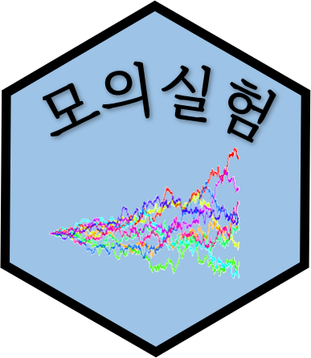
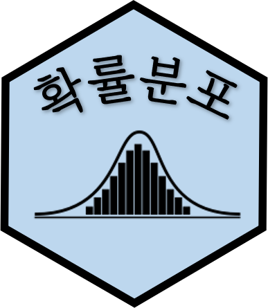
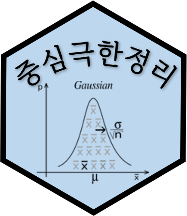
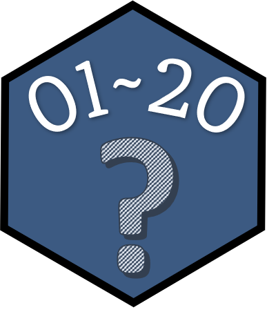
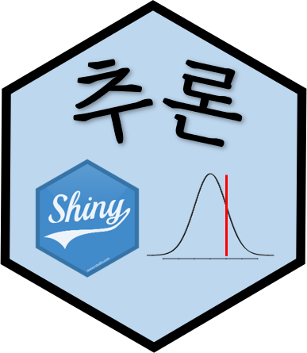
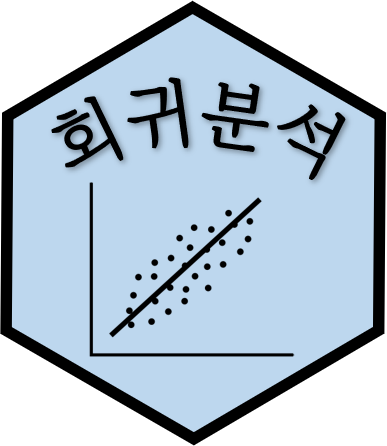
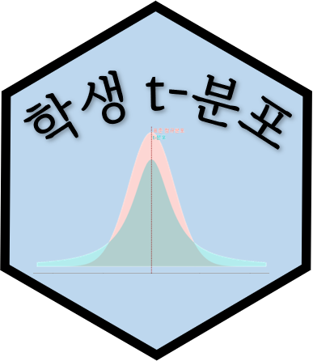
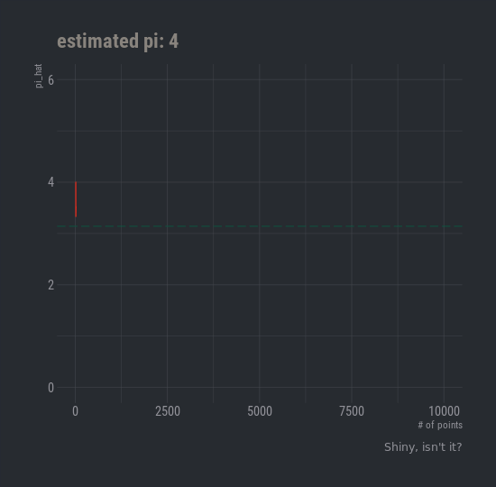

---
output:
  html_document:
    theme:
      version: 4
editor_options: 
  chunk_output_type: console
---


# 귀납적 사고 {#concept}


```{=html}
<div>
<div class="row p-0 row-cols-1 row-cols-md-2 row-cols-lg-3" style="margin-left: -.2rem; margin-right: -.2rem; margin-top: 1rem; margin-bottom: 1rem; ">
<div class="card bg-transparent m-0 border-0 collapse.show bs4cards-blahblahblah " style="padding: .2rem ; border-width: 0; border-radius: .6rem .6rem .6rem .6rem ;">
<div class="card-body m-0 p-0 col-12" style="visibility: visible; border-style:solid; border-color:inherits; border-width:1px; background-color: inherits;border-radius: .6rem .6rem 0 0 ;">
<div class="row no-gutters h-100 border-0" style="border-radius: .6rem .6rem 0 0 ;">
<div class="col-7 h-100">
<a href="https://r2bit.shinyapps.io/simulation/">
<h5 class="card-title my-auto px-3 pt-3 pb-1">모의실험</h5>
</a>
<p class="card-text my-auto px-3 pb-3 pt-1">동전, 주사위 던지기 ...</p>
</div>
<div class="col-5" style="border-radius: 0 .6rem 0 0 ;">
<a href="https://r2bit.shinyapps.io/simulation/" style="color: inherit;">

</a>
</div>
</div>
</div>
<div class="card-footer small text-muted px-3 py-auto" style="border-style:solid; border-color:inherits; border-width:0 1px 1px 1px; border-radius: 0 0 .6rem .6rem ;">2022-06-12</div>
</div>
<div class="card bg-transparent m-0 border-0 collapse.show bs4cards-blahblahblah " style="padding: .2rem ; border-width: 0; border-radius: .6rem .6rem .6rem .6rem ;">
<div class="card-body m-0 p-0 col-12" style="visibility: visible; border-style:solid; border-color:inherits; border-width:1px; background-color: inherits;border-radius: .6rem .6rem 0 0 ;">
<div class="row no-gutters h-100 border-0" style="border-radius: .6rem .6rem 0 0 ;">
<div class="col-7 h-100">
<a href="https://r2bit.shinyapps.io/dist_shiny/">
<h5 class="card-title my-auto px-3 pt-3 pb-1">확률분포</h5>
</a>
<p class="card-text my-auto px-3 pb-3 pt-1">정규, 이산형, 연속형 분포</p>
</div>
<div class="col-5" style="border-radius: 0 .6rem 0 0 ;">
<a href="https://r2bit.shinyapps.io/dist_shiny/" style="color: inherit;">

</a>
</div>
</div>
</div>
<div class="card-footer small text-muted px-3 py-auto" style="border-style:solid; border-color:inherits; border-width:0 1px 1px 1px; border-radius: 0 0 .6rem .6rem ;">2022-06-15</div>
</div>
<div class="card bg-transparent m-0 border-0 collapse.show bs4cards-blahblahblah " style="padding: .2rem ; border-width: 0; border-radius: .6rem .6rem .6rem .6rem ;">
<div class="card-body m-0 p-0 col-12" style="visibility: visible; border-style:solid; border-color:inherits; border-width:1px; background-color: inherits;border-radius: .6rem .6rem 0 0 ;">
<div class="row no-gutters h-100 border-0" style="border-radius: .6rem .6rem 0 0 ;">
<div class="col-7 h-100">
<a href="https://r2bit.shinyapps.io/clt_shiny/">
<h5 class="card-title my-auto px-3 pt-3 pb-1">중심극한정리</h5>
</a>
<p class="card-text my-auto px-3 pb-3 pt-1">대수의법칙과 중심극한정리</p>
</div>
<div class="col-5" style="border-radius: 0 .6rem 0 0 ;">
<a href="https://r2bit.shinyapps.io/clt_shiny/" style="color: inherit;">

</a>
</div>
</div>
</div>
<div class="card-footer small text-muted px-3 py-auto" style="border-style:solid; border-color:inherits; border-width:0 1px 1px 1px; border-radius: 0 0 .6rem .6rem ;">2022-06-17</div>
</div>
<div class="card bg-transparent m-0 border-0 collapse.show bs4cards-blahblahblah " style="padding: .2rem ; border-width: 0; border-radius: .6rem .6rem .6rem .6rem ;">
<div class="card-body m-0 p-0 col-12" style="visibility: visible; border-style:solid; border-color:inherits; border-width:1px; background-color: inherits;border-radius: .6rem .6rem 0 0 ;">
<div class="row no-gutters h-100 border-0" style="border-radius: .6rem .6rem 0 0 ;">
<div class="col-7 h-100">
<a href="https://statkclee.github.io/shiny-apps/flexdashboard/hsData.html">
<h5 class="card-title my-auto px-3 pt-3 pb-1">실용통계</h5>
</a>
<p class="card-text my-auto px-3 pb-3 pt-1">실용통계 데이터셋과 데이터 분석</p>
</div>
<div class="col-5" style="border-radius: 0 .6rem 0 0 ;">
<a href="https://statkclee.github.io/shiny-apps/flexdashboard/hsData.html" style="color: inherit;">

</a>
</div>
</div>
</div>
<div class="card-footer small text-muted px-3 py-auto" style="border-style:solid; border-color:inherits; border-width:0 1px 1px 1px; border-radius: 0 0 .6rem .6rem ;">2022-06-03</div>
</div>
<div class="card bg-transparent m-0 border-0 collapse.show bs4cards-blahblahblah " style="padding: .2rem ; border-width: 0; border-radius: .6rem .6rem .6rem .6rem ;">
<div class="card-body m-0 p-0 col-12" style="visibility: visible; border-style:solid; border-color:inherits; border-width:1px; background-color: inherits;border-radius: .6rem .6rem 0 0 ;">
<div class="row no-gutters h-100 border-0" style="border-radius: .6rem .6rem 0 0 ;">
<div class="col-7 h-100">
<a href="https://r2bit.shinyapps.io/guess_number/">
<h5 class="card-title my-auto px-3 pt-3 pb-1">숫자 맞추기</h5>
</a>
<p class="card-text my-auto px-3 pb-3 pt-1">기회는 3번, 1~20사이 숫자 맞추기</p>
</div>
<div class="col-5" style="border-radius: 0 .6rem 0 0 ;">
<a href="https://r2bit.shinyapps.io/guess_number/" style="color: inherit;">

</a>
</div>
</div>
</div>
<div class="card-footer small text-muted px-3 py-auto" style="border-style:solid; border-color:inherits; border-width:0 1px 1px 1px; border-radius: 0 0 .6rem .6rem ;">2022-06-04</div>
</div>
<div class="card bg-transparent m-0 border-0 collapse.show bs4cards-blahblahblah " style="padding: .2rem ; border-width: 0; border-radius: .6rem .6rem .6rem .6rem ;">
<div class="card-body m-0 p-0 col-12" style="visibility: visible; border-style:solid; border-color:inherits; border-width:1px; background-color: inherits;border-radius: .6rem .6rem 0 0 ;">
<div class="row no-gutters h-100 border-0" style="border-radius: .6rem .6rem 0 0 ;">
<div class="col-7 h-100">
<a href="https://r2bit.shinyapps.io/infer_shiny/">
<h5 class="card-title my-auto px-3 pt-3 pb-1">추론: Shiny</h5>
</a>
<p class="card-text my-auto px-3 pb-3 pt-1">가설 검정 - 평균, 비율, 분산에 대한 추론</p>
</div>
<div class="col-5" style="border-radius: 0 .6rem 0 0 ;">
<a href="https://r2bit.shinyapps.io/infer_shiny/" style="color: inherit;">

</a>
</div>
</div>
</div>
<div class="card-footer small text-muted px-3 py-auto" style="border-style:solid; border-color:inherits; border-width:0 1px 1px 1px; border-radius: 0 0 .6rem .6rem ;">2022-06-10</div>
</div>
<div class="card bg-transparent m-0 border-0 collapse.show bs4cards-blahblahblah " style="padding: .2rem ; border-width: 0; border-radius: .6rem .6rem .6rem .6rem ;">
<div class="card-body m-0 p-0 col-12" style="visibility: visible; border-style:solid; border-color:inherits; border-width:1px; background-color: inherits;border-radius: .6rem .6rem 0 0 ;">
<div class="row no-gutters h-100 border-0" style="border-radius: .6rem .6rem 0 0 ;">
<div class="col-7 h-100">
<a href="https://r2bit.shinyapps.io/reg_shiny/">
<h5 class="card-title my-auto px-3 pt-3 pb-1">회귀분석</h5>
</a>
<p class="card-text my-auto px-3 pb-3 pt-1">선형 회귀 분석</p>
</div>
<div class="col-5" style="border-radius: 0 .6rem 0 0 ;">
<a href="https://r2bit.shinyapps.io/reg_shiny/" style="color: inherit;">

</a>
</div>
</div>
</div>
<div class="card-footer small text-muted px-3 py-auto" style="border-style:solid; border-color:inherits; border-width:0 1px 1px 1px; border-radius: 0 0 .6rem .6rem ;">2022-06-16</div>
</div>
<div class="card bg-transparent m-0 border-0 collapse.show bs4cards-blahblahblah " style="padding: .2rem ; border-width: 0; border-radius: .6rem .6rem .6rem .6rem ;">
<div class="card-body m-0 p-0 col-12" style="visibility: visible; border-style:solid; border-color:inherits; border-width:1px; background-color: inherits;border-radius: .6rem .6rem 0 0 ;">
<div class="row no-gutters h-100 border-0" style="border-radius: .6rem .6rem 0 0 ;">
<div class="col-7 h-100">
<a href="https://r2bit.shinyapps.io/tdist_shiny/">
<h5 class="card-title my-auto px-3 pt-3 pb-1">t-분포&amp;정규분포</h5>
</a>
<p class="card-text my-auto px-3 pb-3 pt-1">t-분포와 표준정규분포 특성</p>
</div>
<div class="col-5" style="border-radius: 0 .6rem 0 0 ;">
<a href="https://r2bit.shinyapps.io/tdist_shiny/" style="color: inherit;">

</a>
</div>
</div>
</div>
<div class="card-footer small text-muted px-3 py-auto" style="border-style:solid; border-color:inherits; border-width:0 1px 1px 1px; border-radius: 0 0 .6rem .6rem ;">2022-06-17</div>
</div>
<div class="card bg-transparent m-0 border-0 collapse.show bs4cards-blahblahblah " style="padding: .2rem ; border-width: 0; border-radius: .6rem .6rem .6rem .6rem ;">
<div class="card-body m-0 p-0 col-12" style="visibility: visible; border-style:solid; border-color:inherits; border-width:1px; background-color: inherits;border-radius: .6rem .6rem 0 0 ;">
<div class="row no-gutters h-100 border-0" style="border-radius: .6rem .6rem 0 0 ;">
<div class="col-7 h-100">
<a href="https://r2bit.shinyapps.io/life_of_pi/">
<h5 class="card-title my-auto px-3 pt-3 pb-1">원주율(π)</h5>
</a>
<p class="card-text my-auto px-3 pb-3 pt-1">몬테카를로 모의시험 방법으로 원주율 계산</p>
</div>
<div class="col-5" style="border-radius: 0 .6rem 0 0 ;">
<a href="https://r2bit.shinyapps.io/life_of_pi/" style="color: inherit;">

</a>
</div>
</div>
</div>
<div class="card-footer small text-muted px-3 py-auto" style="border-style:solid; border-color:inherits; border-width:0 1px 1px 1px; border-radius: 0 0 .6rem .6rem ;">2022-06-02</div>
</div>
</div>
</div>
```


