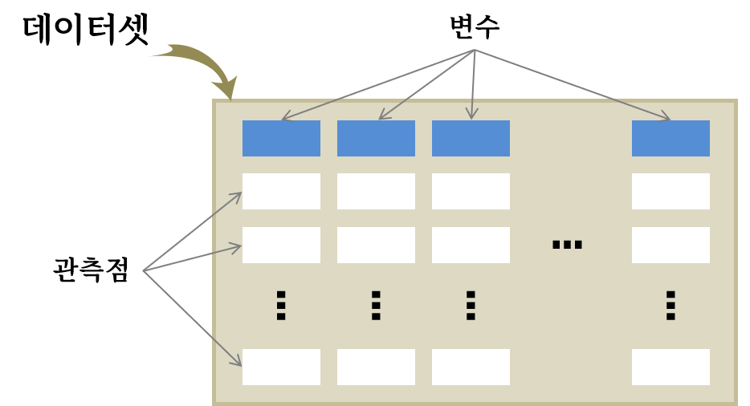
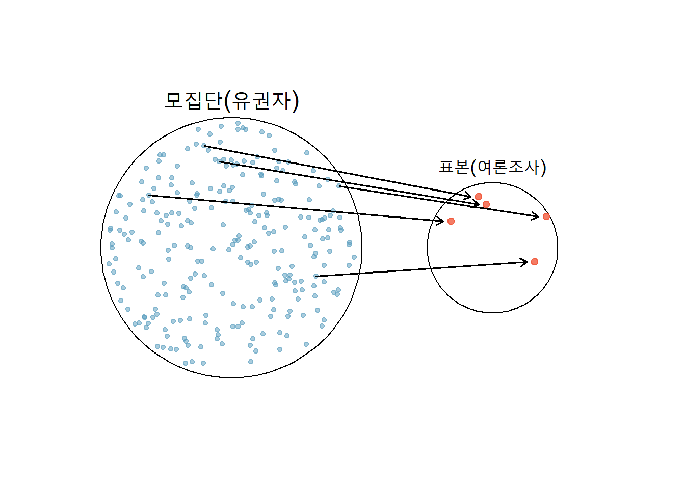
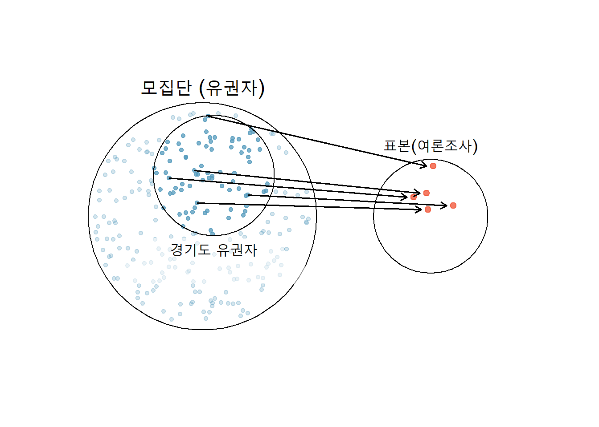
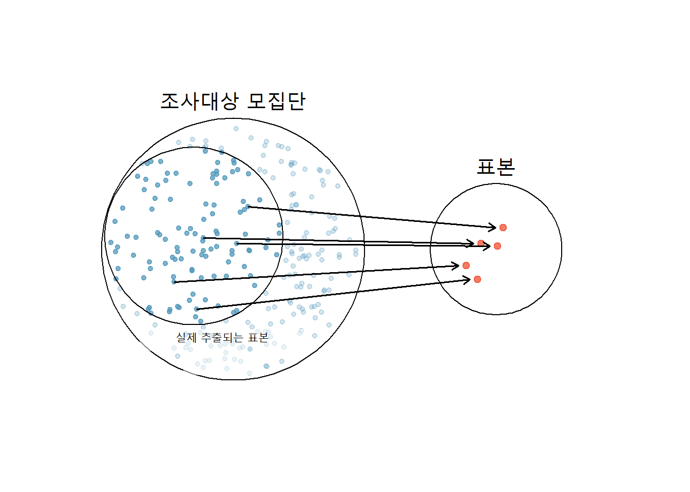

# 데이터 {#about-data}


## 변수와 관측점  {#about-tidydata}

{width=100%}

## 변수 {#about-variables}


```{=html}
<div id="htmlwidget-402a3a3b0f2b2b68ff7b" style="width:576px;height:355.968px;" class="DiagrammeR html-widget"></div>
<script type="application/json" data-for="htmlwidget-402a3a3b0f2b2b68ff7b">{"x":{"diagram":"\n                    graph TD\n                        A[변수] --> B[수치형]\n                        A[변수] --> C[범주형]\n                        B --> D[연속형]\n                        B --> E[이산형]\n                        C --> F[명목형]\n                        C --> G[순서형]\n                    "},"evals":[],"jsHooks":[]}</script>
```


## 변수간 관계 {#about-relation}


## 데이터 수집 원칙 {#data-collection}
 

1. 특정 사례 일반화 오류
1. 모집단과 표본
1. 실험과 관측연구


## 관측연구와 표본 {#data-samples}










