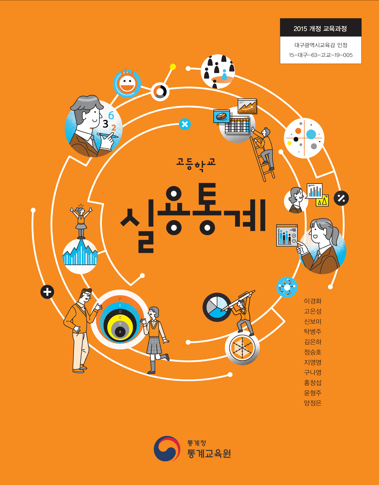
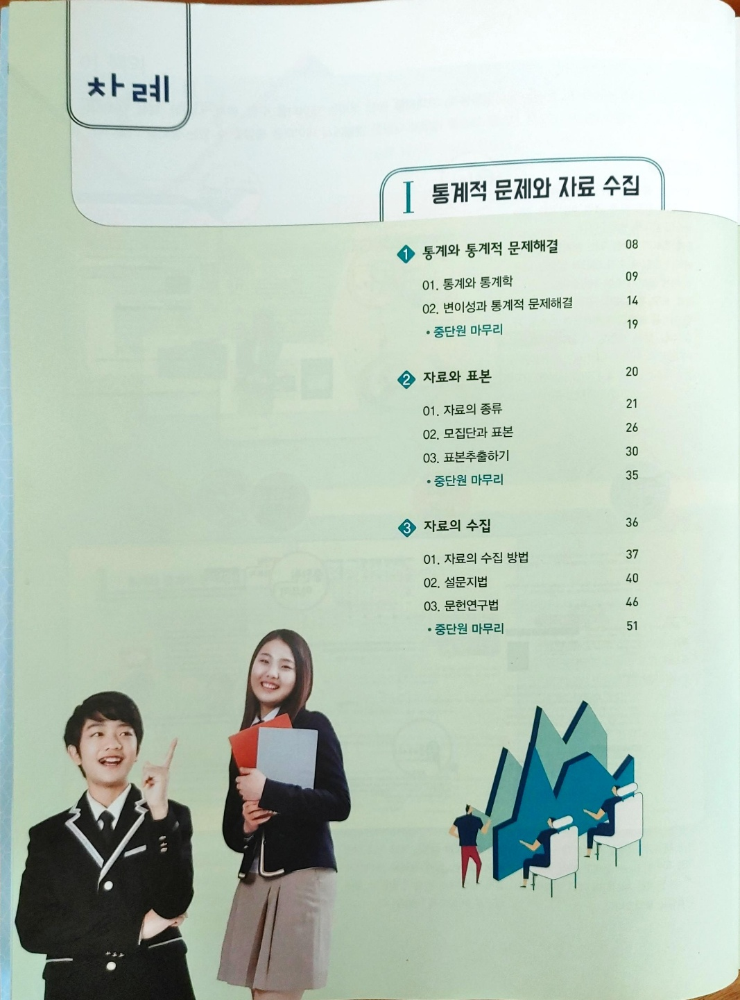
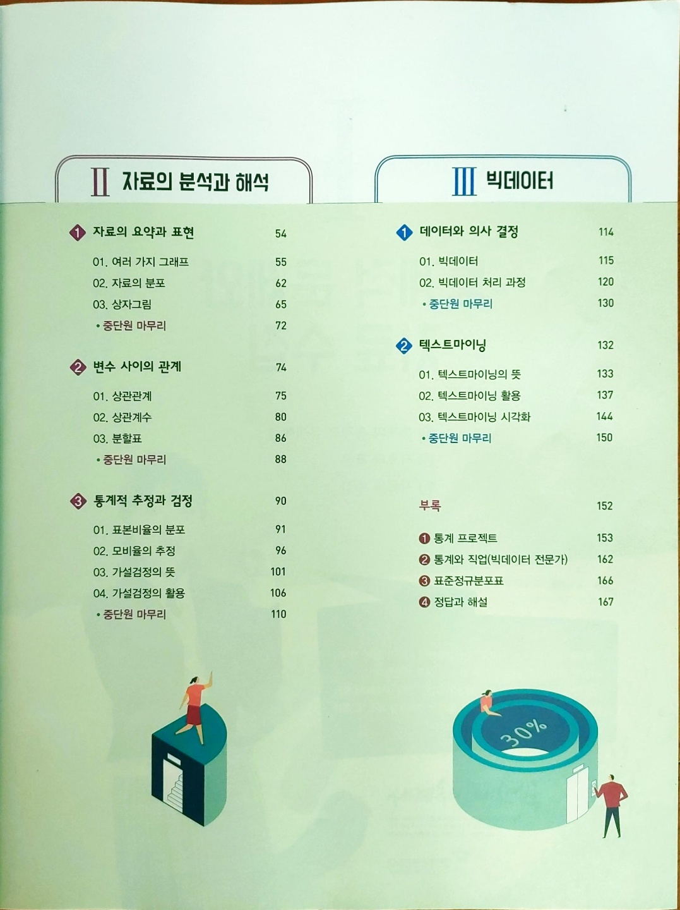
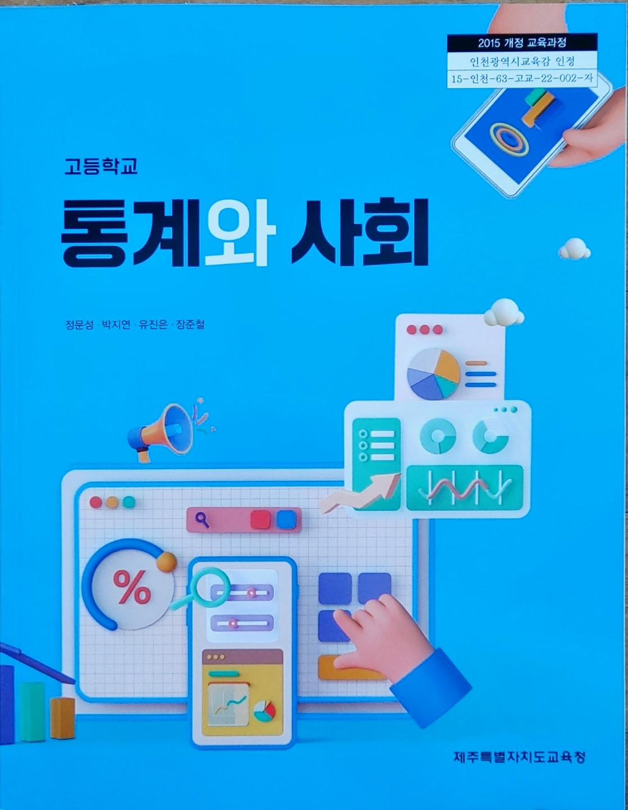
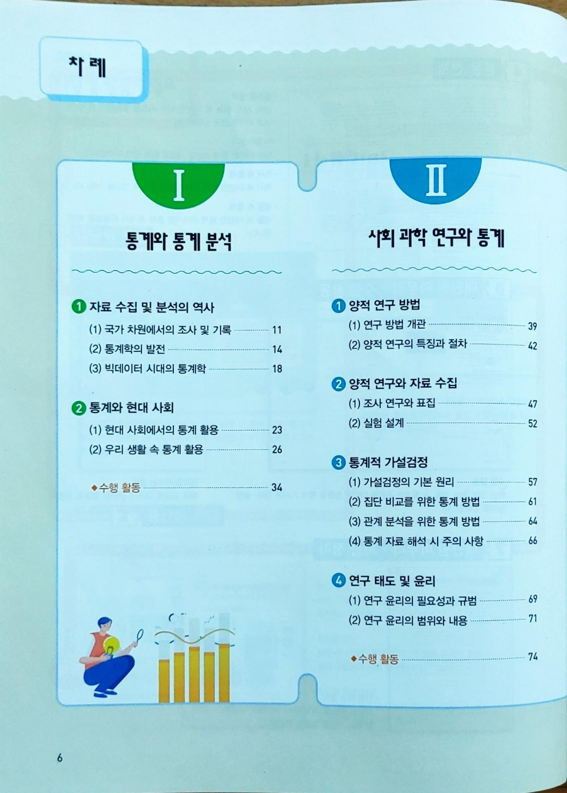
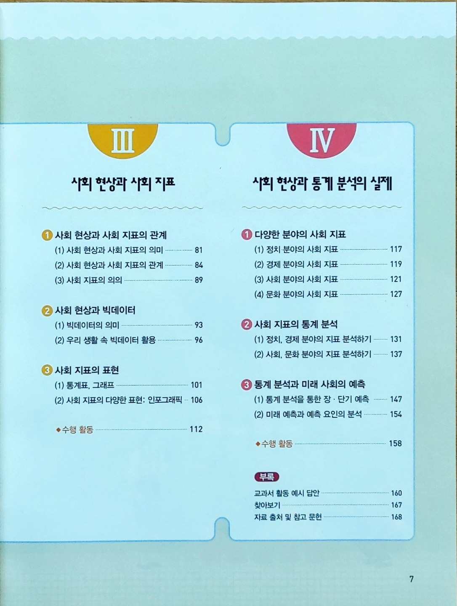

--- 
title: "오픈 통계 교과서"
subtitle: "고등학생"
author: "한국 알(R) 사용자회"
date: "`r Sys.Date()`"
site: bookdown::bookdown_site
output: bookdown::gitbook
toc-title: "목차"   
documentclass: book
bibliography: [book.bib, packages.bib]
biblio-style: apalike
link-citations: yes
github-repo: bit2r/textbook
cover-image: fig/BitStat_logo.png
description: "통계와 데이터 리터러시 함양을 위한 고등학생 오픈 통계 교과서"
editor_options: 
  chunk_output_type: console
---

``` {r setup, include=FALSE}
source("_common.R")
```

# 오픈 통계 교과서 {-}

(중)고등학생 때부터 증거기반 문제해결역량인 통계, 
데이터 리터러시(Data Literacy) 능력이 갈수록 중요함에 따라 다양한 접근법과 
시도되고 있으나 현재까지 명확히 정해진 것이 없다.
이에 비영리법인 한국 알(R) 사용자회에서는 고등학생을 위한 "오픈 통계 교과서"
집필을 결정하게 되었고 더불어 개발중인 빛스탯(BitStat) 오픈 통계 패키지[@lee2022ohmynews]와 묶어 
디지털 전환(Digial Transformation)이 급격히 진행되면서 불거지고 있는 
사회양극화와 불평등 해소에 적극 나서기로 하였다.


- [한국 알 사용자회 (2022-07-23), "데이터 과학자의 세계", 양천구 특강](http://aispiration.com/ds-authoring/ds-world-student.html)
- [설치형 오픈 통계 패키지](https://r2bit.com/Rcmdr/)

## 오픈 통계 교과서 개요 {-}

오픈 통계 교과서는 학생들이 데이터와 통계에 관심을 갖을 수 있도록 먼저 역사적인 사례로 이야기 꾸러미를 푼다.
통계학의 근간을 이루는 귀납적 사고에 대해 이론적인 근거를 살펴보고,
실생활에서 접하는 다양한 데이터를 자세히 다룬다.
이렇게 준비된 데이터를 요약하고, 확률분포를 이용하여 통계적 추론을 통해 
합리적 결론을 도출한다. 
마지막으로 데이터를 통해 확인된 사항을 **재현가능 글쓰기**를 통해 통계에 대한 시작과 마지막으로 
하나의 일관된 체계를 통해 마무리한다.


```{r textbook-overview, echo=FALSE, fig.align = 'center'}
library(DiagrammeR)

mermaid(diagram = '
graph TB    
    A[#1 사례] --> Z[#2 귀납적 사고] 
    Z --> B[#3 데이터]
    B --> C[#4 데이터 요약]
    B --> D[#5 확률분포]
    B --> E[#6 추론]
    C --> G[#7 글쓰기]
    D --> G[#7 글쓰기]
    E --> G[#7 글쓰기]
    ')
  
```

```{r panel-setup, include = FALSE}
xaringanExtra::use_panelset()
xaringanExtra::style_panelset(font_family = "inherit")
```

## 선행 통계 교과서  

대구광역시교육감 인정 통계청 통계교육원에서 제작한 고등학교 "실용통계"와 제주특별자치도교육청 인정 고등학교 "통계와 사회" 교과서가 나와 있다.

### 실용통계 {.panelset}

#### 실용통계 - 표지

{width=100%}

#### 목차 1

{width=100%}

#### 목차 2

{width=100%}

### 통계와사회 {.panelset}

#### 표지

{width=100%}

#### 목차 1

{width=100%}

#### 목차 2

{width=100%}

## 교육과정 {#교육과정}

초중등 수학에서 확률과 통계로 이어지는 과정은 다음과 같이 도식화할 수 있다.

```{r textbook-diagram, echo=FALSE}
mermaid(diagram = '
graph LR    
    A[공통<br>수학] --> B[일반 선택과목<br>확률과 통계]
    B --> G[통계와 사회]
    B --> C[진로 선택과목<br>실용통계]
    C -->|자료구조| D[데이터]
    C -->|알고리즘| E[코딩]
    C -->|자동화| F[인공지능]
    ')
```


---

<h4> 후원계좌 </h4>

디지털 불평등 해소를 위해 제작중인 오픈 통계패키지 개발과 고품질 콘텐츠 제작에 큰 힘이 됩니다.

<div class="container">
  <div class="bd-callout bd-callout-primary">
      - 하나은행 448-910057-06204
      - 사단법인 한국알사용자회
  </div>
</div>


